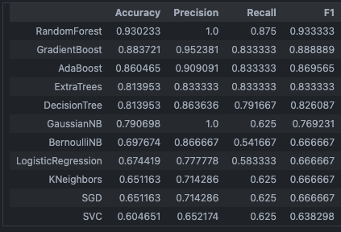

# End-to-End ML Pipeline for Predictive Maintenance

## Project Overview

The objective of this project is to develop a comprehensive machine learning pipeline for predicting equipment failures using historical time series data. The pipeline encompasses all stages of machine learning, including data ingestion, preprocessing, model training, deployment, and monitoring.

### Kaggle dataset
[](https://www.kaggle.com/datasets/hiimanshuagarwal/predictive-maintenance-dataset)

## DEMO 📌
a demo model has been uploaded to streamlit : <br>
[](https://typhonshambo-predictive-maintenance.streamlit.app)

model monitoring dashboard: <br>
[](https://dagshub.com/typhonshambo/End-to-End-ML-Pipeline-for-Predictive-Maintenance.mlflow)

## Model Performance
Currently we are using RandomForest model, based on my EDA I was able to achieve the following scores:<br><br>



The RandomForest model shows the highest accuracy and F1-score, indicating it is likely the best-performing model . 
- `Accuracy : 93%` <br><br>
## Installation

To get started with this project, clone the repository and install the necessary dependencies:
```bash
git clone https://github.com/typhonshambo/End-to-End-ML-Pipeline-for-Predictive-Maintenance
cd End-to-End-ML-Pipeline-for-Predictive-Maintenance
pip install -r requirements.txt
```
## Usage
Running the Streamlit App
```bash
streamlit run streamlit_app.py
```
This will start a local web server where you can interact with the predictive maintenance model through a user-friendly interface.

## Experiment Tracking with MLflow
To start the MLflow tracking server, run:
```bash
mlflow ui
```
This will start the MLflow UI on http://localhost:5000, where you can track experiments, visualize metrics, and manage model versions.

## Modeling Pipeline
The project includes a robust pipeline for data processing, model training, and prediction. The main components are:

- `data_preprocessing.py`: Scripts for cleaning and preprocessing raw data.
- `feature_engineering.py`: Functions to create and transform features.
- `train_model.py`: Scripts to train the predictive maintenance model.
- `prediction_pipeline.py`: Scripts to load the model and make predictions on new data.

## Data

The data directory is structured as follows:

 - `raw/`: Contains the raw dataset files.
 - `processed/`: Contains processed datasets used for training and testing.
 - `streamlit/`: Contains datasets uploaded via the Streamlit app.

